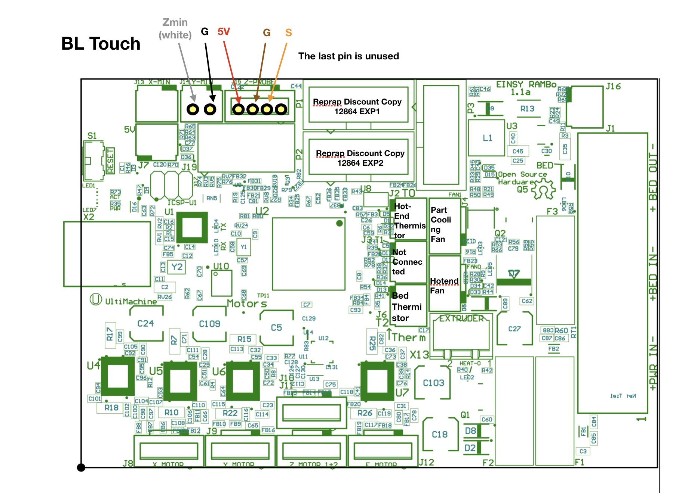

# Marlin-2.0-for-EinsyRambo-Ender3

This is Marlin 2.0 bugfix for the Einsy Rambo board, configured for the Ender 3

# My configuration and Adpating To Your Machine

I have:

* Ender 3
* Non-Stock Hotend with a different thermistor
* 3D Touch from Triangle Labs
* The stock PSU voltage adjustment has been turned up all the way up (it's 27V)
* ReprapDiscount Full Graphical LCD (with SD card) from China

## Setup your Hotend Thermistor

The stock hotend has a thermistor that is different from the one I use, if you have the
stock thermistor, you need to open `Marlin/Configuration.h` and alter the value of `TEMP_SENSOR_1`
to `1` or the thermistor cartrige that your hotend has.

If you have a thermistor that is `5` on Marlin, I have calibrated my thermistor with a thermometer and modified the file `Marlin\src\module\thermistor\thermistor_5.h`. If you don't want to use my calibration, open that file, and copy&paste the commented bottom values to the top.

## Setup your Bed PID

** You can do this after your printer is running with your new board**

I'm using bed PID, because it's smoother and you don't hear the PSU ramping up and down that way. I recommend you to do a bed PID for your machine, connect to a computer (e.g. Pronterface) and execute:

    M303 E-1 C8 S90

And use the bed PID values on `Configuration.h` in section `PID > Bed Temperature Control`.

## Setup your Hotend PID

** You can do this after your printer is running with your new board**

Marlin sucks at doing hotend PID autotunes, never works. I recommend you to do a PID autotune, and use the autotune values for `P`, and keep my values for `I` and `D`.

# Wiring

Note: the board doesn't power up from the USB interface like the stock board does and most other board do. You'll need to plug it to the power supply and turn on.

## About the Power Connectors

This board has proper power terminals compared to the stock board. You'll need to buy fork crimps and crimp the wires (at least, for a "proper" setup).

The board terminals takes fork crimps with 3mm diameter, the PSU takes fork crimps with 4mm diameter.

So, for the board you can buy SV 1.25-3 crimps (normally red in color) and for the PSU, SV 2-4 (normally blue in color).

The board has two connectors that go to the power supply, you'll need to connect them both. One is only used by the bed (**BED IN**), the other is for everything else (**PWR IN**), so, you'll have to have two power lines going from the PSU to the board.

The most important one is the **BED IN** as the bed consumes the most power (by far).

## About The BL Touch

I have a 3D Touch and this Marlin is configured to use it, make sure you follow the wiring diagram (the order on the board is different from the order in the BLT).

Tip: the male-to-male connector it comes with is crap and disconnects itself easily in the loom, I suggest a more stable connection like soldering or plug to plug jumper cables.

## About The Motors

The Ender 3 has JST 2.54mm connectors, the board has Dupont connectors, you can use Dupont plug to socket jumper cables into the JST connectors, or buy cables that already have Dupont terminals in the end, if a motor spins the contrary way, just rotate the connector 180º.

## About The Fans

The Ender 3 uses 24V fans, but this board uses 5V 3 pin fans for the hotend cooling and layer cooling, you can find fans for these in any computer store.

Note that I've configured the hotend fan to only turn on only above 25ºC, so if you connect and the fan is not spinning, it's normal.

## About The LCD

I've been using a chinese RepRapDiscount Full Graphical LCD. The chinese copies are copies of the first version, so you don't need to rotate any cable.

If everything works, but you rotary encoder spins the other way arround, comment the `#define REVERSE_ENCODER_DIRECTION` line in `Configuration.h`.

## About The Hotend Heater

The Hotend heater uses a pcb block terminal that you can search for as `2EDGK`, the pich is 5.08mm (5.00 will also fit), it's easy to find them. Check `heater.jpg` to see the connector.

# 3D-Printable Box and Fisplay Holder

I've designed a box you can use, you can find the box on thingiverse:

https://www.thingiverse.com/thing:3523586

I also designed a mounting system for the display:

https://www.thingiverse.com/thing:3524846

# Uploading

To upload, I found it easier to use Platform IO (https://platformio.org) instead of the Arduino IDE.

I use Visual Studio Code with Platform IO, open the project folder (this root folder), and click the Alien in the right, then in *Project Tasks* at the top, click `env:rambo` and click `Verbose Upload`.

# Contributing

If you have any problem, I'll be happy to help, just open an issue here on GitHub.